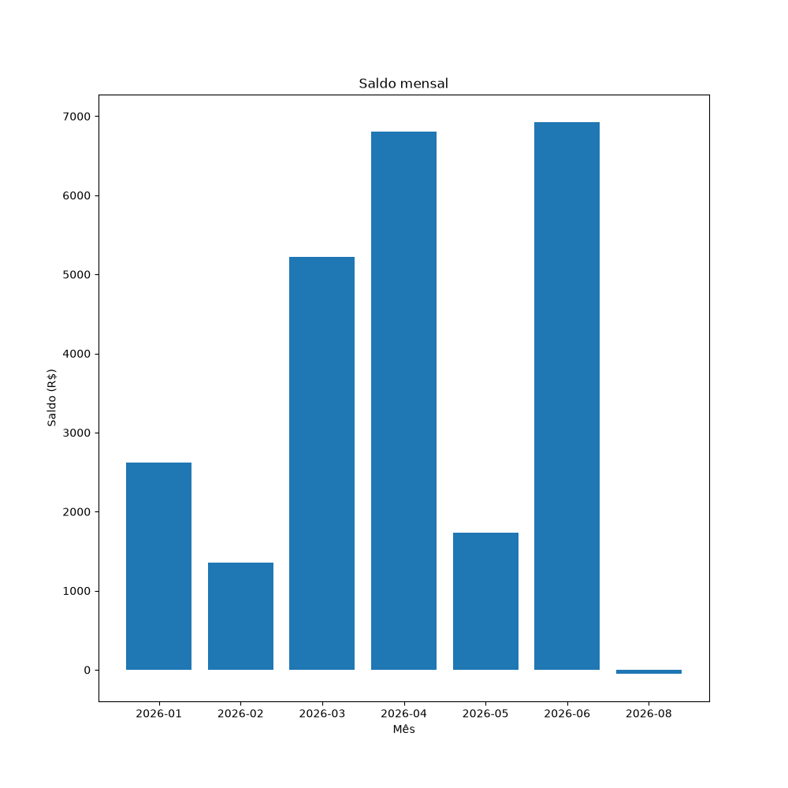
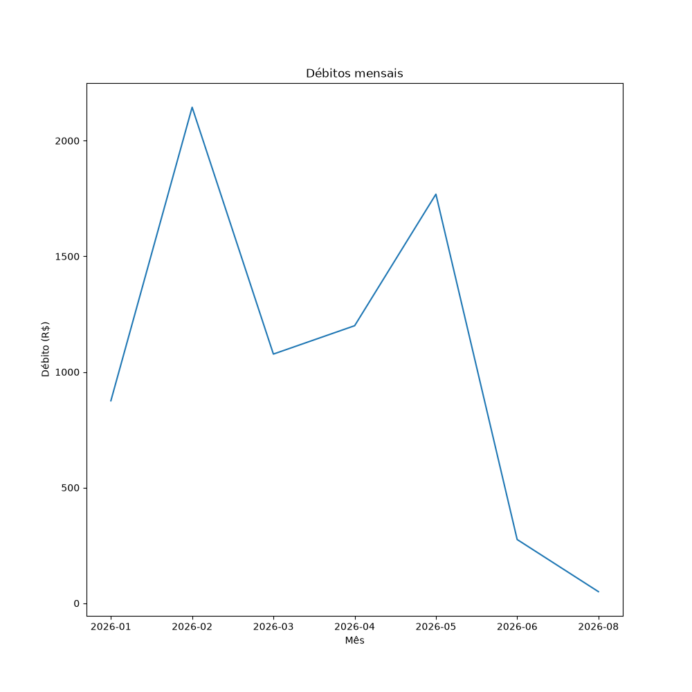
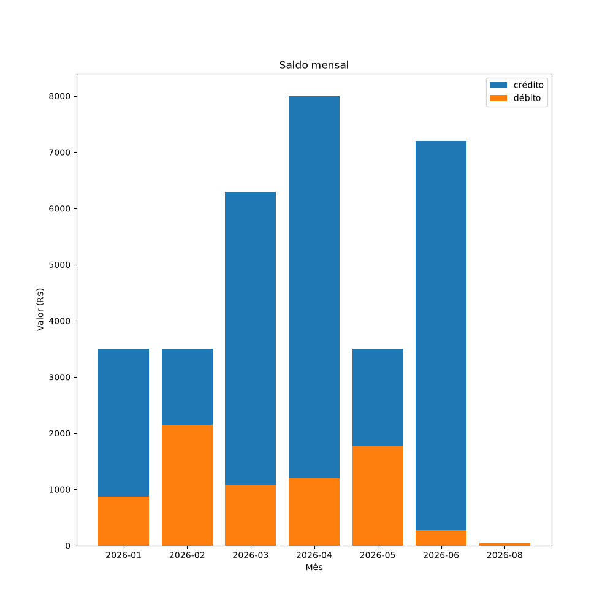

# Clear Bank — Análise de Transações

Análise de transações bancárias do Clear Bank a partir de um arquivo de transcrições CSV. O programa valida cada registro, gera um resumo mensal (créditos, débitos, saldo, média, maior e menor valor), sinaliza transações suspeitas e salva tudo em JSON e exporta imagens de 3 gráficos.

O projeto tem duas versões da mesma análise:

| Arquivo | Descrição | Saída JSON |
|---|---|---|
| [desafio-final.ipynb](desafio-final.ipynb) | Notebook passo a passo, em Python puro (`csv`, `datetime`) | `relatorio.json` |
| [analise_pandas.py](analise_pandas.py) | Script com a mesma lógica usando `pandas` | `relatorio_pandas.json` |

## Estrutura

```
clearbank-analise/
├── transacoes.csv          # dados de entrada
├── desafio-final.ipynb     # análise em Python puro (notebook)
├── analise_pandas.py       # análise com pandas (script)
├── relatorio.json          # saída do notebook
├── relatorio_pandas.json   # saída do script
├── grafico.png             # saldo mensal
├── grafico2.png            # débitos mensais
└── grafico3.png            # crédito x débito por mês
```

## Dados de entrada

O arquivo `transacoes.csv` tem as seguintes colunas:

| Coluna | Tipo | Regra de validação |
|---|---|---|
| `id` | inteiro | Obrigatório, precisa ser um número inteiro |
| `data` | texto | Formato `AAAA-MM-DD` e data real (ex.: `2026-02-31` é rejeitada) |
| `cliente_id` | texto | Não pode ser vazio |
| `tipo` | texto | `credito` ou `debito` |
| `valor` | decimal | Numérico e maior que 0 |
| `descricao` | texto | Descrição livre |
| `categoria` | texto | Ex.: `salario`, `compra`, `transferencia` |

Linhas que não passam na validação são descartadas e contadas como inválidas.

## Como funciona

1. **Leitura** — `ler_transacoes()` lê o CSV.
2. **Validação** — `validar_transacao()` verifica cada linha e retorna o registro limpo, ou `None` se for inválido.
3. **Métricas** — `gerar_relatorio()` agrupa as transações por mês e calcula quantidade, total de crédito, total de débito, saldo (crédito − débito), média por transação, maior e menor valor.
4. **Transações suspeitas** — valores acima de `LIMITE_SUSPEITO` (R$ 10.000,00) são listados separadamente e **não entram** nos totais do mês.
5. **Saída** — `salvar_json()` grava o relatório em JSON, `exibir_relatorio()` imprime o resumo no terminal formatado em reais, e o `matplotlib` gera os gráficos.

## Como executar

### Pré-requisitos

- Python 3.11+
- `pandas` e `matplotlib`

```bash
pip install pandas matplotlib
```

Se estiver usando o ambiente conda do projeto (`.conda`):

```bash
conda install -p ./.conda pandas matplotlib
```

### Versão com pandas (script)

```bash
python analise_pandas.py
```

Gera `relatorio_pandas.json`, os gráficos `grafico*.png` e imprime o relatório no terminal.

### Versão em Python puro (notebook)

Abra o `desafio-final.ipynb` no VS Code ou no Jupyter e execute todas as células (**Run All**). Gera `relatorio.json` e os gráficos.

### Exemplo de saída no terminal

```
Total de linhas lidas 52
Total de linhas válidas 47
Total de linhas inválidas 5
===== RELATÓRIO MENSAL =====
Mês: 2026-01
  Transações:   6
  Total crédito: R$ 3.500,00
  Total débito:  R$ 875,40
  Saldo:         R$ 2.624,60
  ...
===== TRANSAÇÕES SUSPEITAS =====
ID: 4 | Cliente: CLI004 | Data: 2026-01-15 | Valor: R$ 12.500,00
...
```

## Resultados

Das **52** linhas do CSV, **47** são válidas e **5** foram descartadas.

### Resumo mensal

Valores sem as transações suspeitas.

| Mês | Transações | Crédito | Débito | Saldo | Média | Maior | Menor |
|---|---:|---:|---:|---:|---:|---:|---:|
| 2026-01 | 6 | R$ 3.500,00 | R$ 875,40 | R$ 2.624,60 | R$ 729,23 | R$ 3.500,00 | R$ 45,00 |
| 2026-02 | 8 | R$ 3.500,00 | R$ 2.144,60 | R$ 1.355,40 | R$ 705,58 | R$ 3.500,00 | R$ 60,00 |
| 2026-03 | 7 | R$ 6.300,00 | R$ 1.077,35 | R$ 5.222,65 | R$ 1.053,91 | R$ 3.500,00 | R$ 85,00 |
| 2026-04 | 8 | R$ 8.000,00 | R$ 1.200,00 | R$ 6.800,00 | R$ 1.150,00 | R$ 4.500,00 | R$ 65,00 |
| 2026-05 | 7 | R$ 3.500,00 | R$ 1.768,70 | R$ 1.731,30 | R$ 752,67 | R$ 3.500,00 | R$ 64,90 |
| 2026-06 | 5 | R$ 7.200,00 | R$ 275,50 | R$ 6.924,50 | R$ 1.495,10 | R$ 3.500,00 | R$ 95,50 |
| 2026-08 | 1 | R$ 0,00 | R$ 50,00 | −R$ 50,00 | R$ 50,00 | R$ 50,00 | R$ 50,00 |

Não há transações em julho de 2026.

### Transações suspeitas (acima de R$ 10.000,00)

| ID | Cliente | Data | Valor |
|---:|---|---|---:|
| 4 | CLI004 | 2026-01-15 | R$ 12.500,00 |
| 11 | CLI004 | 2026-02-14 | R$ 15.000,00 |
| 22 | CLI002 | 2026-03-25 | R$ 18.500,00 |
| 47 | CLI003 | 2026-03-10 | R$ 15.000,00 |
| 35 | CLI004 | 2026-05-16 | R$ 22.000,00 |

O cliente **CLI004** aparece em 3 das 5 transações suspeitas.

### Gráficos

**Saldo mensal**



**Débitos mensais**



**Crédito x débito por mês**


